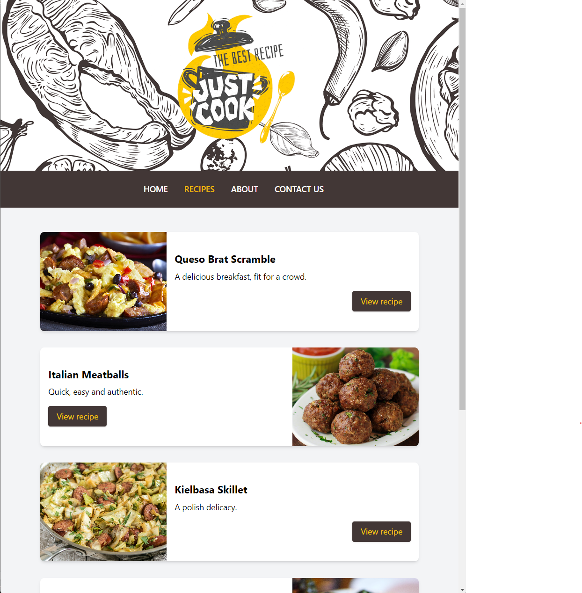
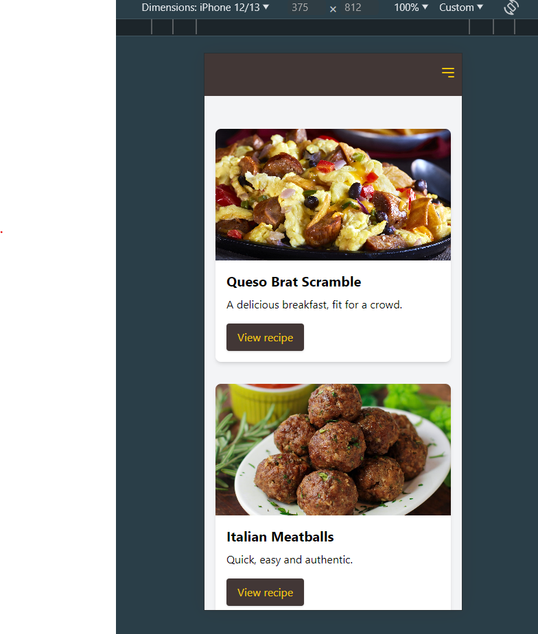
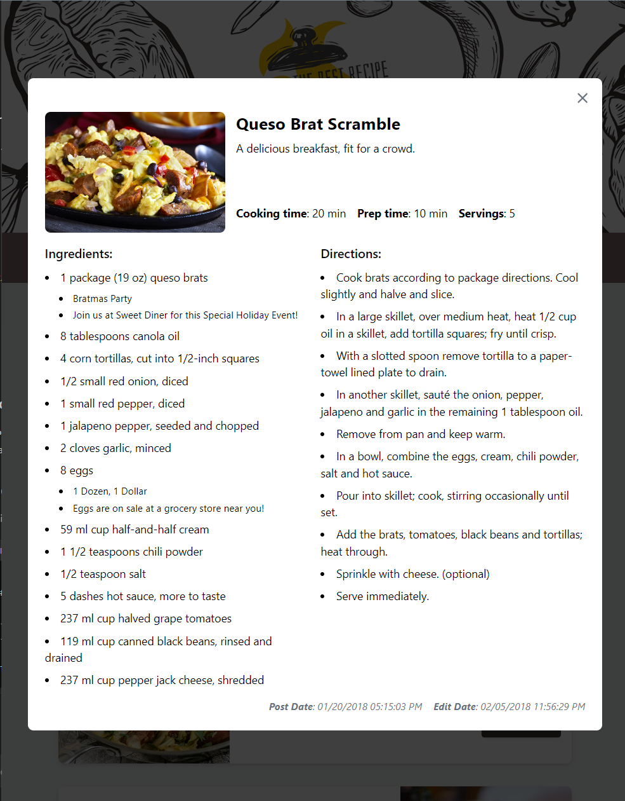
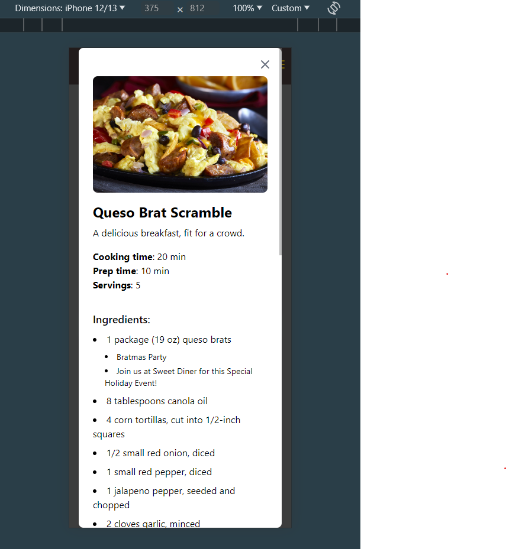

# Recipe Web App

## Table of Contents

- [Screenshots](#screenshots)
- [Features](#features)
- [Tech Stack](#tech-stack)
   - [Frontend](#frontend)
- [Getting Started](#getting-started)
   - [Prerequisites](#prerequisites)
   - [Installation](#installation)
   - [Running the App](#running-the-app)
   - [Running `json-server`](#running-json-server)

## Screenshots

| Desktop View | Mobile View |
|--------------|-------------|
|  |  |
|  |  |


## Features

- **Recipe Listing**: View a list of available recipes with images and brief descriptions.
- **Recipe Details**: Click on a recipe to view detailed information, including ingredients, and cooking instructions.
- **Special Offers**: View special offers related to certain ingredients.
- **Responsive Design**: Optimized for both desktop and mobile viewing.
- **Lazy Loading Images**: Improve performance by loading images only when they are about to be displayed.
- **Error Handling**: Gracefully handle and display errors when fetching data.

## Tech Stack

### Frontend

- **React**: A JavaScript library for building user interfaces.
- **React Router**: A standard library for routing in React.
- **TypeScript**: A typed superset of JavaScript that compiles to plain JavaScript.
- **Vite**: A fast frontend build tool and development server.
- **Tailwind CSS**: A utility-first CSS framework for rapidly building custom user interfaces.

## Getting Started

### Prerequisites

- **Node.js**: Ensure you have Node.js installed.
- **npm/Yarn**: Ensure you have npm or Yarn installed.

### Installation

 To install the dependencies, run command below:
   ```sh
   npm install
   # or
   yarn install
   ```

### Running the App

1. Start the development server:
   ```sh
   npm run dev
   # or
   yarn dev
   ```

2. Open your browser and navigate to:
   ```
   http://localhost:3000
   ```

### Running `json-server`

1. Start mock server:
   ```sh
   npm run json-server:start
   # or
   yarn json-server:start
   ```

2. You can view `response` with these URL endpoints on your browser:
   ```
   http://localhost:3001/recipes
   http://localhost:3001/specials
   ```